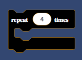
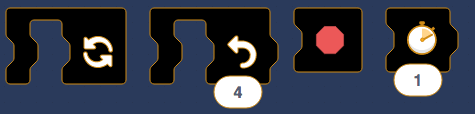

This is a set of tools that makes it easy to create themes/skins for [Scratch-Blocks](https://github.com/LLK/scratch-blocks) (and Scratch 3.0).

This is a **work-in-progress**. Everything is subject to change. Use at your own risk. :package:

# How it works
sb3-theme adds classes to every block so you can easily style them with CSS. For an explanation of these classes, see [the wiki](https://github.com/Airhogs777/sb3-theme/wiki/Classes). It also has a few other functions that make styling easier.

# Getting Started
The easiest way to play with this right now is to download or clone this repo. There's a copy of the Scratch-Blocks repo inside of the `tests` folder, where you can tinker with it.

If you really want your own copy, download the above file called `sb3-theme.js` and insert it into your copy of `horizontal_playground.html` or `vertical_playground.html`. Eventually, I might put this on gh-pages so you can just link it.

# Example
## make control blocks black
```html
<script src="sb3-theme.js"></script>
<style>
.control > path { /* use the child selector to avoid interfering with inputs */
  fill: black;
}
.control > text {
  font-family: serif;
}
</style>
```
Result:




#### [For more examples, see the wiki.](https://github.com/Airhogs777/sb3-theme/wiki/Code-Examples)

# Methods and Properties
## Methods

* `addInit(function)` - add a function to run once after the SVG has been initialized. Right now, you only need to use it for addFilter.
* `addOnChange(function)` - add a function that will run every time the number of blocks changes.
* `addFilter(string)` - add a filter to the `<defs>` area of the SVG. Input should be a string containing an entire `<filter>` tag and its contents.
* `getBlocksWithText(string)` - returns an array of newly-added SVG groups whose text contains the text `string`. All the text will be separated by spaces, and inputs/nested blocks should be ignored. For example, `repeat times`. Note that this returns the groups, which can contain text, paths (backgrounds), and even other groups.
* `getBlocksWithIcon(string)` - returns an array of newly-added SVG groups whose icon URL contains the substring `string`. Again, it's groups, not paths.

## Properties

* `newBlocks` - an array of blocks that have been added in the last onChange event. Note that this includes inputs.
* `horizontal` - true if you're in horizontal mode. This only updates with onChange, you can't access it immediately.
* `css` - a `<style>` element that I've created just for you. Do what you wish with it. Or don't. It won't mind.
* `svg` - the `<svg>` element in which the editor is housed.
* `dragsvg` - the `<svg>` element where blocks go while you drag them.
* `defs` - the `<defs>` element where you'll find filters and things.
