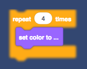

This set of tools should make it easier to write themes/skins for [Scratch-Blocks](https://github.com/LLK/scratch-blocks) (and Scratch 3.0). It might work for vanilla Blockly too, but I haven't tested it there.

This is a work-in-progress. Everything is subject to change. Use at your own risk. :package:

# Examples
```javascript
var t = new Sb3Theme();

// "addInit" funcions only run when the editor is first opened
t.addInit(function() {

  // add a blur filter to the SVG
  t.addFilter(`<filter id="myFilter">
    <feGaussianBlur in="SourceGraphic" stdDeviation="3" y="-"/>
  </filter>`);

  // add the filter to all elements with the class "myRepeats"
  t.css.innerHTML += `.myRepeats {
    filter: url(#myFilter)
  }`;
});

// "addOnChange" functions run whenever the number of blocks changes
t.addOnChange(function() {

  // find all the blocks with the word "repeat"
  var repeats = t.getBlocksWithText('repeat');

  // give them all the class name "myRepeats"
  repeats.forEach(function(elem) {
    elem.classList.add("myRepeats");
  });
});
```
Result:

